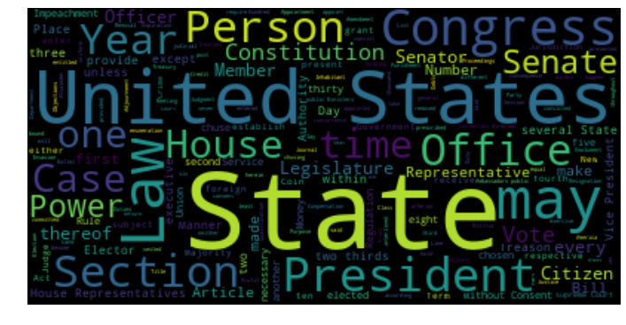
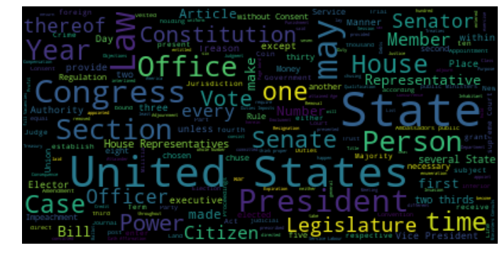
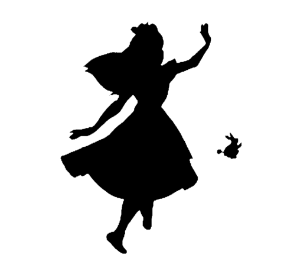
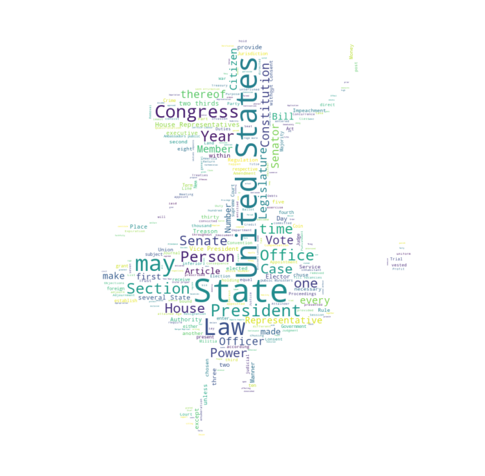
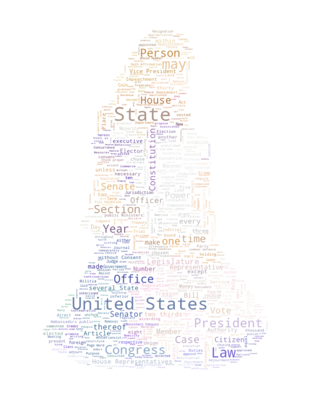

```python
import matplotlib.pyplot as plt
%matplotlib inline

from wordcloud import WordCloud
```

### wordCloud 생성


```python
text = open('constitution.txt').read()
wordcloud = WordCloud().generate(text)
```


```python
wordcloud.words_
```


    {'Act': 0.07575757575757576,
     'Adjournment': 0.045454545454545456,
     'Ambassadors public': 0.06060606060606061,
     'Amendment': 0.06060606060606061,
     'America': 0.045454545454545456,
     'Appointment': 0.06060606060606061,
     'Article': 0.13636363636363635,
     'Attainder': 0.045454545454545456,


### wordCloud 생성


```python
plt.figure(figsize=(12,12))
plt.imshow(wordcloud, interpolation='bilinear')
plt.axis("off")
plt.show()
```





### max font size


```python
wordcloud = WordCloud(max_font_size=40).generate(text)
plt.figure(figsize=(12,12))
plt.imshow(wordcloud, interpolation='bilinear')
plt.axis("off")
plt.show()
```





### wordCloud using masking


```python
import numpy as np
from PIL import Image
from wordcloud import STOPWORDS
```


```python
alice_mask = np.array(Image.open("alice_mask.png"))
stopwords = set(STOPWORDS)
stopwords.add("said")
```


```python
plt.figure(figsize=(8,8))
plt.imshow(alice_mask, cmap=plt.cm.gray, interpolation='bilinear')
plt.axis("off")
plt.show()
```





```python
wc = WordCloud(background_color = "white", max_words = 2000, mask = alice_mask, stopwords = stopwords)
wc = wc.generate(text)
```


```python
plt.figure(figsize=(12, 12))
plt.imshow(wc, interpolation = 'bilinear')
plt.axis("off")
plt.show()
```





### color Image Mask


```python
alice_coloring = np.array(Image.open("alice_color.png"))
```


```python
from wordcloud import ImageColorGenerator
image_colors = ImageColorGenerator(alice_coloring)
```


```python
wc = WordCloud(background_color='white', \
               max_words=2000, mask=alice_coloring, \
               stopwords=stopwords, max_font_size = 40, random_state=42)
wc.generate(text)   
```


    <wordcloud.wordcloud.WordCloud at 0x1a6f5e17da0>


```python
plt.figure(figsize=(12, 12))
plt.imshow(wc.recolor(color_func=image_colors), interpolation="bilinear")
plt.axis("off")
plt.show()
```





### 한글 text cloud


```python
from konlpy.tag import Twitter
import nltk
t = Twitter()
```


```python
lyric = open("idol.txt").read()
token_ko = t.nouns(lyric)
```


```python
from matplotlib import font_manager, rc

font_name = font_manager.FontProperties(fname="c:/Windows/Fonts/ahn_b.ttf").get_name()
rc('font', family=font_name)
```


```python
wc = WordCloud(font_path = "c:/Windows/Fonts/ahn_b.ttf", background_color='white', mask=irin_coloring, max_words= 1000, max_font_size = 60).generate(lyric)
```


```python
irin_coloring = np.array(Image.open("irin.jpg"))
image_colors = ImageColorGenerator(irin_coloring)
```


```python
plt.figure(figsize=(12, 12))
plt.imshow(irin_coloring)
plt.axis("off")
plt.show()
```


```python
plt.figure(figsize=(12, 12))
plt.imshow(wc.recolor(color_func=image_colors), interpolation="bilinear")
plt.axis("off")
plt.show()
```


